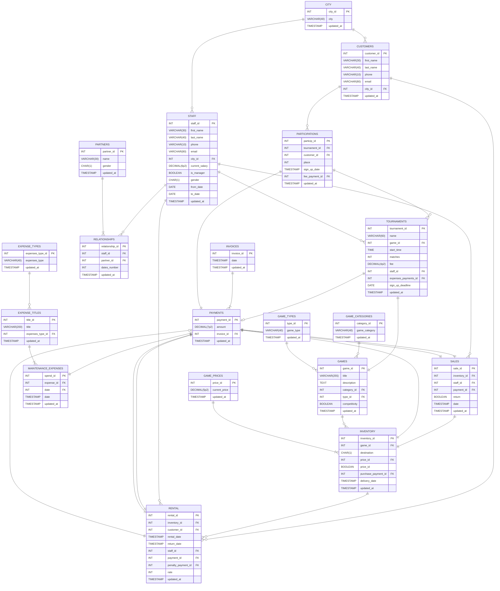

# Dokumentacja konstrukcji bazy danych

Dokumnetujemy tu działanie bazy danych dla stacjonarnego sklepu Geeks & Dragons, funkcjonującego we Wrocławiu od dwóch lat[^1]. Zajmuje się on sprzedażą i wypożyczaniem gier planszowych (oraz podobnych) oraz organizacją turniejów w tych grach.

## Spis treści

- [Dokumentacja konstrukcji bazy danych](#dokumentacja-konstrukcji-bazy-danych)
  - [Spis treści](#spis-treści)
  - [Schemat bazy danych](#schemat-bazy-danych)
  - [Zawartość tabel oraz zależności funkcyjne](#zawartość-tabel-oraz-zależności-funkcyjne)
    - [Tabela `city`](#tabela-city)
    - [Tabela `customers`](#tabela-customers)
    - [Tabela `participations`](#tabela-participations)
    - [Tabela `tournaments`](#tabela-tournaments)
    - [Tabela `rental`](#tabela-rental)
    - [Tabela `inventory`](#tabela-inventory)
    - [Tabela `staff`](#tabela-staff)
    - [Tabela `relationships`](#tabela-relationships)
    - [Tabela `partners`](#tabela-partners)
    - [Tabela `payments`](#tabela-payments)
    - [Tabela `invoices`](#tabela-invoices)
    - [Tabela `maintenance_expenses`](#tabela-maintenance_expenses)
    - [Tabela `expense_titles`](#tabela-expense_titles)
    - [Tabela `expense_types`](#tabela-expense_types)
    - [Tabela `sales`](#tabela-sales)
    - [Tabela `games`](#tabela-games)
    - [Tabela `game_categories`](#tabela-game_categories)
    - [Tabela `game_types`](#tabela-game_types)
    - [Tabela `game_prices`](#tabela-game_prices)
  - [Uzasadnienie normalności postaci bazy (EKNF)](#uzasadnienie-normalności-postaci-bazy-eknf)

## Schemat bazy danych

Zaczniemy od schematu bazy danych, aby od początku mieć pojęcie, o jakiej strukturze relacyjnej mówimy. Diagram ER omawianej bazy danych przedstawiamy na poniższej interaktywnej wizualizacji.

__UWAGA!__ Jeżeli używany przez Ciebie silnik MD nie generuje ilustracji z kodu `mermaid`, możesz zobaczyć także [zapis tej ilustracji](images/ERD.svg) (jest to plik _svg_; najlepiej otwierać go po pobraniu w przeglądarce). Dostępna jest też uproszczona wersja schematu (bez atrybutów i ich typów) w formacie _png_. Możesz go zobaczyć [tutaj](images/ERD_simplified.png).

## Zawartość tabel oraz zależności funkcyjne

Następnie, po kolei opiszemy co znajduje się w poszczególnych tabelach, kreśląc generalną mechanikę, jaką przyjęliśmy. Dla każdej tabeli wypisujemy też wraz z komentarzem listę zależności funkcyjnych (a właściwie __nieredundantne pokrycie__). Pomijamy zatem zależności, które można wywnioskować trzema regułami Armstronga, a w szczególności oczywiście zależności trywialne.

### Tabela `city`

Jest to spis wszystkich miejscowości (w naszym przypadku są to dla uproszczenia miasta Dolnego Śląska), które dotyczą bądź kiedyś dotyczyły obsługi oraz klientów.

| Atrybut | Opis |
|-------------|--------|
| `city_id` | numer identyfikacyjny miasta (PK) |
| `city` | nazwa miejscowości |
| `updated_ad` | moment ostatniej zmiany w krotce |

Zależności funkcyjne to:

- {`city_id`} &rarr; {`city`, `updated_at`}

Nie może się tu wiele więcej zdarzyć. Możnaby też myśleć o sytuacji, gdzie klucz główny zależy od nazwy miasta. Zwróćmy jednak uwagę, że na ogół występują różne miejscowości o takich samych nazwach. Z tego powodu pomijamy tego typu zapis.

### Tabela `customers`

Mamy tutaj zarejestrowanych klientów sklepu, czyli uczesników gier turniejowych oraz tych, którzy choć raz wypożyczali jakiś produkt. Zapisujemy ich podstawowe dane. W uproszczeniu nie zbieramy całego ich adresu zamieszkania, a jedynie miasto. Zakładamy także, że wszyscy są z Dolnego Śląska (jest to uzasadnione przybliżenie, gdyż skala działania nie jest taka, aby posiadać klientów z całego kraju, ale też nie są oni tylko z Wrocławia).

| Atrybut | Opis |
|-------------|--------|
| `customer_id` | numer identyfikacyjny klienta (PK) |
| `first_name` | imię |
| `last_name` | nazwisko |
| `phone` | numer telefonu kontaktowego |
| `email` | adres e-mail do kontaktu |
| `city_id` | numer identyfikacyjny miasta zamieszkania (FK) |
| `updated_at` | moment ostatniej zmiany w krotce |

Zależności funkcyjne to:

- {`customer_id`} &rarr; {`first_name`, `last_name`, `phone`, `email`, `city_id`, `updated_at`}

Istnieje możliwość, że adresy e-mail (`email`) lub numery telefonów (`phone`) nie są unikalne dla każdego uczestnika, gdyż w teorii kilka osób może korzystać z jednej skrzynki bądź telefonu przy kontakcie - na przykład jako organizacja. Przy uczestnictwie w wydarzeniach (takich jak choćby turnieje) jest to spotykana praktyka. To, że dodatkowo imiona, nazwiska, czy miasta niczego nie określają jednoznacznie, jest chyba oczywiste. Jedynie dodany osobno klucz główny może rozpoczynać nietrywialne zależności funkcyjne.

### Tabela `participations`

Jest to zbiór przypisań uczestników do turniejów. Każdy uczestnik może bowiem zapisać się wiele turniejów (maksymalnie jednokrotnie każdy). Co do ilości uczestników w turnieju, dozwolona jest zerowa, ale wtedy po prostu zawody mimo ogłoszenia się nie odbędą (bez konsekwencji w bazie). Maksymalnie jest zaś ona ograniczona przez ilość określonych w turnieju partii przemnożonych przez narzucony limit uczestników w konkretnej grze.

| Atrybut | Opis |
|-------------|--------|
| `particip_id` | numer identyfikacyjny zapisu (PK) |
| `tournament_id` | numer identyfikacyjny turnieju (FK) |
| `customer_id` | numer identyfikacyjny klienta (FK)  |
| `place` | miejsce zajęte przez uczestnika na danym turnieju |
| `sign_up_date` | czas zapisu danego uczestnika na turniej |
| `fee_payment_id` | numer identyfikacyjny płatności wpisowego za uczestnictwo (FK) |
| `updated_at` | moment ostatniej zmiany w krotce |

Zależności funkcyjne to:

- {`particip_id`} &rarr; {`tournament_id`, `customer_id`, `place`, `sign_up_date`, `fee_payment_id`, `updated_at`}
- {`fee_payment_id`} &rarr; {`particip_id`, `tournament_id`, `customer_id`, `place`, `sign_up_date`, `updated_at`}
- {`tournament_id`, `customer_id`} &rarr; {`particip_id`, `place`, `sign_up_date`, `fee_payment_id`, `updated_at`}

Poza działaniem opisanym wyżej, zajęte miejsca nie identyfikują żadnych wierszy. Wiele uczestników może też się w jednym momencie zapisać. Płatności zawsze są zaś dokonywane osobno.

Para identyfikatora turnieju oraz klienta jest sama w sobie kluczem kandydującym, bo określa jednoznacznie zapis.

### Tabela `tournaments`

Są to turnieje organizowane przez sklep. Jeden turniej dotyczy jednej konkretnej gry. Każdy składa się z konkretnej ilości meczy i ma jednego pracownika-opiekuna. Każdy rekord przechowuje dodatkowe dane na temat wydarzenia samego w sobie. Wydatki na organizację obejmują zakup nagród itp. (przy czym traktujemy wszystkie wydatki razem, jako jedna płatność). W jednym czasie zaś może odbywać się wyłącznie jednen turniej. Zakładamy, że lokal nie ma możliwości na więcej.

| Atrybut | Opis |
|-------------|--------|
| `tournament_id` | numer identyfikacyjny turnieju (PK) |
| `name` | nazwa turnieju |
| `game_id` | numer identyfikacyjny gry używanej w turnieju (FK) |
| `start_time` | dzień i godzina, w którym zaczyna się turniej |
| `matches` | liczba partii w obrębie turnieju |
| `fee` | ustalona wpisowa opłata za uczestnictwo |
| `sign_up_deadline` | ostatni dzień, w którym otwarte są zapisy |
| `staff_id` | numer identyfikacyjny pracownika odpowiedzialnego za turniej (FK) |
| `expenses_payments_id` | numer identyfikacyjny płatności związanych z wydatkami na organizację (FK)  |
| `updated_at` | moment ostatniej zmiany w krotce |

Zależności funkcyjne to:

- {`tournament_id`} &rarr; {`name`, `game_id`, `start_time`, `matches`, `fee`, `sign_up_deadline`, `staff_id`, `expenses_payments_id`, `updated_at`}
- {`start_time`} &rarr; {`tournament_id`, `name`,  `game_id`, `matches`, `fee`, `sign_up_deadline`, `staff_id`, `expenses_payments_id`, `updated_at`}

Sama nazwa turnieju nie identyfikuje wydarzenia, gdyż potencjalnie cykliczność może narzucić tę samą nazwę. Pozostałe (poza numerem oraz datą) atrybuty, nawet wzięte razem, nie mogą z zupełną pewnością zidentyfikować wydarzenia.

### Tabela `rental`

Ta tabela jest rejestrem wszystkich wypożyczeń w historii sklepu. Wypożyczana jest gra z magazynu (tylko z puli tych, które są na to przeznaczone) i wydawana klientowi na okres 5 dni za stałą ustaloną kwotę, obliczaną dla każdej gry. Dodatkowo, każdy dzień przekroczenia terminu skutkuje kumulowanym naliczeniem kary w wysokości 30% ceny jednorazowego wypożyczenia gry. Zakładamy, że opłata za wypożyczenie naliczana jest od razu, a kara przy zwrocie produktu. Jeśli klient jest terminowy, płatność kary pozostawiona jest z pustym identyfikatorem. Przypadek klienta, który nigdy nie oddaje gry nie wpływa na mechanikę bazy. Jego płatność kary może być tylko inna, niż przewidują podstawowe zasady, ale o tym zdecyduje sąd.

| Atrybut | Opis |
|-------------|--------|
| `rental_id` | numer identyfikacyjny wypożyczenia (PK) |
| `inventory_id` | numer identyfikacyjny pozycji w magazynie (FK) |
| `customer_id` | numer identyifkacyjny klienta (FK) |
| `rental_date` | data i godzina wypożyczenia |
| `return_date` | data i godzina zwrotu (pusta, jeśli wypożyczenie wciąż trwa) |
| `staff_id` | numer identyfikacyjny pracownika wydającego grę (FK) |
| `payment_id` | numer identyfikacyjny płatności za usługę (FK) |
| `penalty_payment_id` | numer identyfikacyjny ewentualnej płatności kary (FK) |
| `rate` | ocena gry przez klienta (od 1 do 10; opcjonalna) |
| `updated_at` | moment ostatniej zmiany w krotce |

Zależności funkcyjne to:

- {`rental_id`} &rarr; {`inventory_id`, `customer_id`, `rental_date`, `return_date`, `staff_id`, `payment_id`, `penalty_payment_id`, `rate`, `updated_at`}
- {`inventory_id`, `rental_date`} &rarr; {`rental_id`, `customer_id`, `return_date`, `staff_id`, `payment_id`, `penalty_payment_id`, `rate`, `updated_at`}
- {`payment_id`} &rarr; {`rental_id`, `inventory_id`, `customer_id`, `rental_date`, `return_date`, `staff_id`, `penalty_payment_id`, `rate`, `updated_at`}

Konkretny prodykukt w jednym momencie wzkazukje na wszystkie pola rekordu, bo jest unikalny. Para kliena i daty wypożyczenia, bez wskazania produktu, nie identyfikuje usługi. Klient może chcieć za jednym razem przecież kilka gier. Podobnie klient i produkt, gdyż każdy może wypożyczać produkt wiele razy. Płatność zaś identyfikuje konkretną pozycję. Przy okazji tabeli `payments` omówimy, iż faktycznie klient może w teorii robić większe zakupy na jeden rachunek. W takim przypadku poszczególne "płatności" są grupowane w cały "koszyk" już w tamtej tabeli. Reszta faktów jest dość oczywista, m.in. opcjonalny identyfikator płatności kary nie może niczego wskazywać.

### Tabela `inventory`

Wszystkie posiadane kiedykolwiek przez sklep gry, bo Geeks & Dragons ma na stanie wyłącznie gry. Te, które są cały czas na magazynie (lub są wypożyczone i jeszcze nie oddane) mają status aktywnych (`active = TRUE`). Jeżeli są już zniszczone, zaginą itd., ich status jest negatywny. Pozostają wtedy zatem jedynie historycznym zapisem. Każda gra jest kiedyś zakupowana przez sklep jeżeli jest w obrocie, ma ustalaną cenę. Cena będzie oczywiście mniejsza dla wynajmu. Każdy produkt ma też osobne przeznaczenie - albo jest do sprzedaży (`S`), albo na wypożyczenie (`R`), albo do użytku turniejowego (`T`). Nigdy te przeznaczenia nie są mieszane w jednym momencie, gdyż nie można wypożyczać produktu, który ma być używany w turnieju, a z drugiej strony, używane gry nie będą sprzedawane. Mamy więc ekskluzywność kategorii.

| Atrybut | Opis |
|-------------|--------|
| `inventory_id` | numer identyfikacyjny produktu (PK) |
| `game_id` | numer identyfikacyjny gry, jaką stanowi produkt (FK) |
| `destination` | przeznaczenie (`S` - 'sales', `R` - 'rental', `T` - 'tournaments')|
| `price_id` | numer identyfikacyjny ceny (FK) |
| `active` | status posiadania gry na stanie |
| `purchase_payment_id` | numer identyfikacyjny płatności związanej z zakupem (FK) |
| `delivery_date` | data i godzina wprowadzenia nowego produktu do magazynu |
| `updated_at` | moment ostatniej zmiany w krotce |

Zależności funkcyjne to:

- {`inventory_id`} &rarr; {`game_id`, `destination`, `price_id`, `active`, `purchase_payment_id`, `delivery_date`, `updated_at`}

Celowo nie wspominamy tu o zależności ceny od pary gry i jej przeznaczenia. Chcemy dopuścić możliwość, że nawet pośród tych samych gier i przeznaczenia (np. do sprzedaży), można nadawać w celach marketingowych przeceny tylko kilku sztukom (powiedzmy tym, które wystawione są na półkach podczas, gdy takie same produky leżą z inną ceną w magazynie). Naturalnie, jeżeli produkt jest przeznaczony na turnieje, nie musi dostawać swojej ceny, ale nie są to jedyne przypadki pustego pola z `price_id`. Jeżeli pracownik przyjmie dostawę, a nie zdąży wprowadzić ceny, pole pozostaje z wartością `NULL`. Nie jest to groźne, gdyż w każdym momencie można cenę nadać według bieżącej polityki sklepu. Z drugiej strony wartość `T` przeznaczenia nie zawsze wiąże się z brakiem ceny, gdyż produkt mógł z kategorii wypożyczanego być tymczasowo przeniesiony do kategorii turniejowego, bez likwidacji przypisanej ceny.

### Tabela `staff`

W niej przechowujemy informacje o wszystkich pracownikach, którzy kiedykolwiek pracowali w firmie. Część atrybutów jest analogiczna do występujących w `customers`. Nie będziemy się nad tymi ponownie szczegółowo pochylać.

| Atrybut | Opis |
|-------------|--------|
| `staff_id` | numer identyfikacyjny pracownika (PK) |
| `first_name` | imię |
| `last_name` | nazwisko |
| `phone` | numer telefonu kontaktowego |
| `email` | adres e-mail do kontaktu |
| `city_id` | numer identyfikacyjny miasta zamieszkania (FK) |
| `current_salary` | aktualna bazowa pensja miesięczna |
| `is_manager` | informacja o tym, czy pracownik jest managerem |
| `gender` | płeć pracownika (pole może mieć wartość `M`, `F` lub być puste) |
| `from_date` | data rozpoczęcia pracy w sklepie |
| `to_date` | data zwolnienia (jeśli osoba nadal pracuje, pole pozostaje puste) |
| `updated_at` | moment ostatniej zmiany w krotce |

Zależności funkcyjne to:

- {`staff_id`} &rarr; {`first_name`, `last_name`, `phone`, `matches`, `email`, `city_id`, `current_salary`, `is_manager`, `gender`, `from_date`, `to_date`, `updated_at`}

Znów teoretyczna (choć skrajnie mało prawdopodobna) możliwość istnienia kilku pracowników o tym samym nazwisku, pochodzeniu, zatrudnionych w tym samym czasie itd. decyduje o tym, że nie znajdą się inne zależności, które możemy wypisać.

### Tabela `relationships`

Ciekawą (i dość osobliwą) praktyką firmy jest wtykanie nosa w życie miłosne pracowników. Mają oni raportować wszystkich swoich partnerów z okresu pracy w firmie wraz z liczbą randek (według uznania pracownika - stopień zbliżenia jest bowiem subiektywny). Co do danych personalnych partnerów, wystarczy podać ich imię i płeć (ale nie trzeba). W końcu RODO i tak dalej... Cała sytuacja ma służyć wyłącznie analizie produktywności i nie ma związku z dewiacjami właściciela. Przynajmniej taka jest oficjalna wersja.

| Atrybut | Opis |
|-------------|--------|
| `relationship_id` | numer identyfikacyjny relacji (PK) |
| `staff_id` | numer identyfikacyjny pracownika (FK) |
| `partner_id` | numer identyfikacyjny partnera (FK) |
| `dates_number` | liczba randek w obrębie relacji |
| `updated_at` | moment ostatniej zmiany w krotce |

Zależności funkcyjne to:

- {`relationship_id`} &rarr; {`staff_id`, `partner_id`, `dates_number`, `updated_at`}

W związkiu z możliwymi odejściami i powrotami, dopuszczamy możliwość kilku relacji między danym pracownikiem a partnerem, z osobnym licznikiem spotkań. Przecież czasem trzeba sobie dać szanse na start od nowa, z czystą kartą... Ponadto, znając identyfikator partnera, nie możemy jednoznacznie ocenić, jakiego pracownika dotyczył związek miłosny. Teoretyczne romanse w pracy mogą skutkować odbijaniem sobie nawzajem partnerów.

### Tabela `partners`

Ta tabela jest "rozszerzeniem" tabeli `relationships`, zawierającym już konkretne dane na temat partnerów.

| Atrybut | Opis |
|-------------|--------|
| `partner_id` | numer identyfikacyjny partnera (PK) |
| `name` | imię bądź pseudonim danego partnera |
| `gender` | płeć partnera (pole może mieć wartość `M`, `F` lub być puste) |
| `updated_at` | moment ostatniej zmiany w krotce |

Zależności funkcyjne to:

- {`partner_id`} &rarr; {`name`, `gender`, `updated_at`}

Widać wyraźnie, że nie da się budować innych zależności funkcyjnych z tak skąpego zestawu danych o partnerach. Samo imię też oczywiście nie wyznacza płci, gdyż Wrocław wcale nie jest mocno konserwatywnym miastem.

### Tabela `payments`

To rejestr wszystkich płatności związanych z działalnością sklepu. Jeżeli w bazie pojawia się jakikolwiek wydatek, swoim kluczem obcym odnosi się do rekordów tej tabeli. W zależności, czy pozycja w rejestrze dotyczy przychodu (np. ze sprzedaży), czy wydatku, kwoty mogą być dodatnie lub ujemne. Dodatkowo, uznajemy na ogół każdą wartość jako jedną konkretną pozycję, dotycząc jednego produktu, specyfiki itp. To, że kilka gier może być przykładowo kupione na jednen paragon notujemy numerem atrybutu `invoice`. Jest identyfikator paragonu czy faktury związanej z daną grupą płatności lub jedną płatnością. Każda płatność ma przypisaną jakąś "fakturę".

| Atrybut | Opis |
|-------------|--------|
| `payment_id` | numer identyfikacyjny opłaty (PK) |
| `amount` | wartość pojedynczej płatności (w walucie PLN) |
| `invoice_id` | numer paragonu/faktury |
| `updated_at` | moment ostatniej zmiany w krotce |

Zależności funkcyjne to:

- {`payment_id`} &rarr; {`amount`, `invoice_id`, `updated_at`}

Wyraźnie widać, że kwota bądź numer "faktury" nie są wstanie wskazać konkretnej płatności nawet razem.

### Tabela `invoices`

Jest to rejestr grup płatności - faktur i paragonów związanych z dowolnymi płatnościami w firmie. Nie rozpisujemy tu większych szczegółów oprócz daty rozliczenia dla takiej grupy płatności.

Warto zauważyć, że data jakiejś operacji finansowej nie jest tożsama z datą realizacji płatności! Po to właśnie mimo dat obecnych w innych tabelach, też tutaj jest osobna data. Miejmy na uwadze czas realizacji przelewów, blokady środków i inne podobne zdarzenia. Tak więc data płatności "faktury" będzie zazwyczaj taka sama jak daty operacji, ale tak nie musi być.

| Atrybut | Opis |
|-------------|--------|
| `invoice_id` | numer identyfikacyjny grupy płatności (PK) |
| `date` | data i godzina rozliczenia |
| `updated_at` | moment ostatniej zmiany w krotce |

Zależności funkcyjne to:

- {`invoice_id`} &rarr; {`date`, `updated_at`}

Przedstawione zależności funkcyjne są raczej oczywiste.

### Tabela `maintenance_expenses`

Wszystkie historyczne wydatki związane z utrzymaniem sklepu, mediami, płacami dla pracowników (zantowane przy pracowanikach kwoty to tylko ich obecne stawki a nie cała historia) itp. Zauważmy, że nie obejmują one dostaw, gdyż te zanotowane są już przy produktach w magazynie.

| Atrybut | Opis |
|-------------|--------|
| `spend_id` | numer identyfikacyjny wydatku (PK) |
| `title_id` | numer identyfikacyjny tytułu wydatku (FK) |
| `payment_id` | numer identyfikacyjny płatności (FK) |
| `date` | data i godzina związana z wydatkiem |
| `updated_at` | moment ostatniej zmiany w krotce |

Zależności funkcyjne to:

- {`spend_id`} &rarr; {`title_id`, `payment_id`, `date`, `updated_at`}
- {`payment_id`} &rarr; {`spend_id`, `title_id`, `date`, `updated_at`}

Aby zapobiec istnieniu w tabeli tytułów implikująceych konkretny typ wydatku, a mogących się powtarzać, mamy tu tylko referencje do tytułów. Niestety tytuł nie jest nadkluczem i dodatkowa struktura jest wymagana w żądanej postaci normalnej.

Konieczna byłaby mechanika w systemie sklepu, która dla każdego tytułu sprawdza czy ten już istniał. Brzmi to na niezbyt sensowną logikę, ale pewne wymagania należy formalnie spełnić.

### Tabela `expense_titles`

Są to unikalne tytuły wydatków wraz z przypisanymi kategoriami.

| Atrybut | Opis |
|-------------|--------|
| `title_id` |  numer identyfikacyjny tytułu wydatku (PK) |
| `title` | opisowy tytuł wydatku |
| `expenses_type_id` | numer identyfikacyjny typu wydatków (FK) |
| `updated_at` | moment ostatniej zmiany w krotce |

Zależności funkcyjne to:

- {`title_id`} &rarr; {`title`, `expenses_type_id`, `updated_at`}
- {`title`} &rarr; {`title_id`, `expenses_type_id`, `updated_at`}

Tytuły zą z założenia unikalne.

### Tabela `expense_types`

Zawarte są w niej typy (czyli kategorie) wydatków.

| Atrybut | Opis |
|-------------|--------|
| `expenses_type_id` | numer identyfikacyjny typu wydatków (PK) |
| `expenses_type` | nazwa typu (kategorii) wydatków |
| `updated_at` | moment ostatniej zmiany w krotce |

Zależności funkcyjne to:

- {`expenses_type_id`} &rarr; {`expenses_type`, `updated_at`}
- {`expenses_type`} &rarr; {`expenses_type_id`, `updated_at`}

Typy wydatków utrzymaniowych są też z założenia unikalne.

### Tabela `sales`

Jest to zestawienie wszystkich operacji zakupowych dokonanych przez klientów - zakupów oraz ewentualnych zwrotów produktów. Te drugie są oznaczane jako zwyczajne rekordy, ale z flagą `return`. Jeżeli dochodzi do zwrotu, rekord z produktem identyfikowany jest po płatności i nowo wprowadzany rekord - już oflagowany, z nowym kluczem głównym - dotyczy oddanych klientowi środków na tym danym produkcie. Ma też oczywiście nową datę, a proces może być przeprowadzany z innym pracownikiem.

| Atrybut | Opis |
|-------------|--------|
| `sale_id` | numer identyfikacyjny zakupu/zwrotu (PK) |
| `inventory_id` | numer identyfikacyjny produktu (FK) |
| `staff_id` | numer identyfilkacyjny pracownika obsługującego sprzedaż (FK) |
| `payment_id` | numer identyfikacyjny płatności (FK) |
| `date` | data i godzina związana z zakupem |
| `return` | flaga oznaczająca, że dana operacja jest zwrotem produktu |
| `updated_at` | moment ostatniej zmiany w krotce |

Zależności funkcyjne to:

- {`sale_id`} &rarr; {`inventory_id`, `staff_id`, `payment_id`, `date`, `updated_at`}
- {`payment_id`} &rarr; {`sale_id`, `inventory_id`, `staff_id`, `date`, `updated_at`}

Identyfikator płatności czy zakupu jednoznacznie wyznacza operację. W związku z tym, iż może dojść do zwrotów (legalnych w świetle prawa), produkt nie rozpoczyna żadnej zależności funkcyjnej. O dacie czy pracowniku chyba nie trzeba wspominać.

### Tabela `games`

Jest to zestawienie gier zarejestrowanych przez sklep wraz ze szczegółami na temat ich rodzaju. Nie są to pozycje w magazynie, a zwyczajnie unikalne propozycje dostępne na rynku.

| Atrybut | Opis |
|-------------|--------|
| `game_id` | numer identyfikacyjny gry (PK) |
| `title` | tytuł gry |
| `description` | opis gry |
| `category_id` | numer identyfikacyjny kategorii tematycznej (FK) |
| `type_id` | numer identyfikacyjny typu gry (FK) |
| `competitivity` | możliwość przeprowadzania zawodów z grą |
| `updated_at` | moment ostatniej zmiany w krotce |

Zależności funkcyjne to:

- {`game_id`} &rarr; {`title`, `description`, `category_id`, `type_id`, `competitivity`, `updated_at`}
- {`title`} &rarr; {`game_id`, `description`, `category_id`, `type_id`, `competitivity`, `updated_at`}

Tytuł gry jest także unikalnym identyfikatorem. Uznajemy, że sklep nie posiada odmiennych gier o tym samym tytule. Jeżeli by się tak zdarzyło zbiegiem okoliczności, zakładamy zapis tych tytułów np. z jakimś deskryptywnym przyrostkiem. Kategorie, typy, czy możliwość grania turniejowego to niezależne informacje. Opis gry jest opcjonalny i też o niczym nie świadczy.

### Tabela `game_categories`

Są to kategorie tematyczne, opisujące różne gry.

| Atrybut | Opis |
|-------------|--------|
| `category_id` | numer identyfikacyjny kategorii gry (PK) |
| `game_category` | nazwa kategorii tematycznej |
| `updated_at` | moment ostatniej zmiany w krotce |

Zależności funkcyjne to:

- {`category_id`} &rarr; {`game_category`, `updated_at`}
- {`game_category`} &rarr; {`category_id`, `updated_at`}

Mamy tutaj prostą relację jednoznaczności numeru kategorii i jej nazwy. Nie przewidujemy różnych kategorii o tej samej nazwie, gdyż ten koncept nie ma sensu.

### Tabela `game_types`

Są to typy gier nieelektronicznych, jakimi określane są poszczególne pozycje na liście gier.

| Atrybut | Opis |
|-------------|--------|
| `type_id` | numer identyfikacyjny typu gry (PK) |
| `game_type` | nazwa typu gry |
| `updated_at` | moment ostatniej zmiany w krotce |

Zależności funkcyjne to:

- {`type_id`} &rarr; {`game_type`, `updated_at`}
- {`game_type`} &rarr; {`category_id`, `updated_at`}

Znów, mówimy o prostej dwustronnej zależności typu i jego numeru. Wyjaśnienie takiej logiki jest analogiczne do przypadku kategorii.

### Tabela `game_prices`

Relacje tu zebrane to ceny za konkretne produkty w sklepie. Mogą być różne nawet dla jednego typu produktu, w zależności od jego stanu czy innych szczegółów polityki sklepu. Jeżeli produkty są przeznaczone do wypożyczenia, cena dotyczy wypożyczenia. Mechanizmy sklepu musiałyby przewidywać po prostu jednoczesną zmianę identyfikatora ceny przy zmianie przeznaczenia produktu.

Sens tej tabeli to możliwość grupowania cen dla podkategorii tego samego produktu w dowolny sposób.

| Atrybut | Opis |
|-------------|--------|
| `price_id` | numer identyfikacyjny typu ceny (PK) |
| `current_price` | aktualna cena związana z danym zbiorem produktów |
| `updated_at` | moment ostatniej zmiany w krotce |

Zależności funkcyjne to:

- {`price_id`} &rarr; {`current_price`, `updated_at`}

Nie pozostawiają one wiele do tłmaczenia. Zdaje się, że takie wynikanie jest kolejny raz jasne.

## Uzasadnienie normalności postaci bazy (EKNF)

Do tego momentu właściwie już wykazaliśmy że baza jest w standardzie EKNF. Formalnie wyjaśmimy to jeszcze niżej.

Wszystkie wartości w kolumnach są skalarne, a wiersze unikalne, dzięki dbającym o to, dodanym osobno (unikalnym) kluczom głównym (_1NF_).

Widzimy też, że nie ma częściowych zależności funkcyjnych atrybutów niegłównych od kluczy kandydujących (wystarczy to do _2NF_). Są nieraz takie zależności od nadkuczy w ogóle, ale nigdy od kluczy kandydujących.

Wreszcie, wszystkie przedstawione przypadki zależności funkcyjnych (zarówno te wypisane, jak i przez nie implikowane) rozpoczynają się od nadklucza (daje nam to _3NF_ i _EKNF_).

Wiemy, że omawiane atrybuty rozpoczynające zależności są nadkluczami, ponieważ - jak widać - identyfikują one pełne krotki. Wypisane punkty obejmują szczególne przypadki, bo tylko klucze kandydujące, ale konstruując wg. zasad wnioskowania pozostałe zależności, mamy też takie, które rozpoczynają się od niekandydujących nadkluczy.

[^1]: Razem z wieloma innymi - założenie podjęte w ramach szczegółowej decyzji, o rodzaju działalności przedsiębiorstwa, będącego obiektem rozważań.
