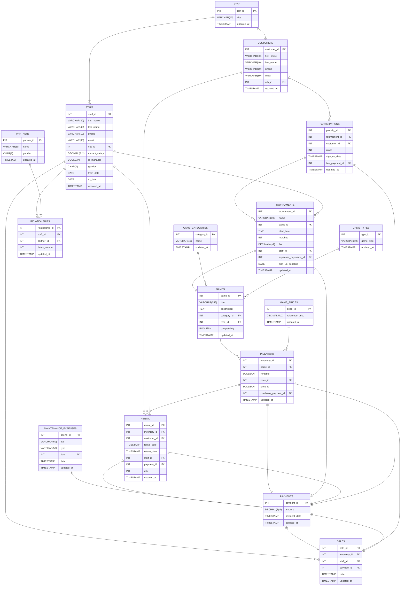

# XXX

Dokumnetujemy tu działanie bazy danych dla stacjonarnego sklepu Geeks & Dragons, funkcjonującego we Wrocławiu od dwóch lat[^1]. Zajmuje się on sprzedażą i wypożyczaniem gier planszowych (oraz podobnych) oraz organizacją turniejów w tych grach.

## Zawartość tabel oraz zależności funkcyjne

Po kolei opiszemy, co znajduje się w poszczególnych tabelach kreśląc generalną mechanikę, jaką przyjęliśmy. Dla każdej tabeli wypisujemy też wraz z komentarzem listę zależności funkcyjnych (nieredundantne pokrycie). Pomijamy jednocześnie w oczywisty sposób zależności trywialne.

### Tabela `customers`

Mamy tutaj zarejestrowanych klientów sklepu, czyli uczesników gier turniejowych oraz tych, którzy choć raz wypożyczali jakiś produkt. Zapisujemy ich podstawowe dane. W uproszczeniu nie zbieramy całego ich adresu zamieszkania, a jedynie miasto. Zakładamy także, że wszyscy są z Dolnego Śląska (jest to uzasadnione przybliżenie, gdyż skala działania nie jest taka, aby posiadać klientów z całego kraju, ale też nie są oni tylko z Wrocławia).

| Atrybut | Opis |
|-------------|--------|
| `customer_id` | numer identyfikacyjny klienta (PK) |
| `first_name` | imię |
| `last_name` | nazwisko |
| `phone` | numer telefonu kontaktowego |
| `email` | adres e-mail do kontaktu |
| `city_id` | numer identyfikacyjny miasta zamieszkania (FK) |
| `updated_at` | moment ostatniej zmiany w krotce |

Zależności funkcyjne to:

- {`customer_id`} $\rightarrow$ {`first_name`, `last_name`, `phone`, `email`, `city_id`, `updated_at`}

Istnieje możliwość, że adresy e-mail (`email`) lub numery telefonów (`phone`) nie są unikalne dla każdego uczestnika, gdyż w teorii kilka osób może korzystać z jednej skrzynki bądź telefonu przy kontakcie - na przykład jako organizacja. Przy uczestnictwie w wydarzeniach (takich jak choćby turnieje) jest to spotykana praktyka. To, że dodatkowo imiona, nazwiska, czy miasta niczego nie określają jednoznacznie, jest chyba oczywiste. Jedynie dodany osobno klucz główny może rozpoczynać nietrywialne zależności funkcyjne.

### Tabela `participations`

Jest to zbiór przypisań uczestników do turniejów. Każdy uczestnik może bowiem zapisać się wiele turniejów (maksymalnie jednokrotnie każdy). Co do ilości uczestników w turnieju, dozwolona jest zerowa, ale wtedy po prostu zawody mimo ogłoszenia się nie odbędą (bez konsekwencji w bazie). Maksymalnie jest zaś ona ograniczona przez ilość określonych w turnieju partii przemnożonych przez narzucony limit uczestników w konkretnej grze.

| Atrybut | Opis |
|-------------|--------|
| `particip_id` | numer identyfikacyjny (PK) |
| `tournament_id` | numer identyfikacyjny turnieju (FK) |
| `customer_id` | numer identyfikacyjny klienta (FK)  |
| `place` | miejsce zajęte przez uczestnika na danym turnieju |
| `sign_up_date` | czas zapisu danego uczestnika na turniej |
| `fee_payment_id` | numer identyfikacyjny płatności wpisowego za uczestnictwo (FK) |
| `updated_at` | moment ostatniej zmiany w krotce |

Zależności funkcyjne to:

- {`particip_id`} $\rightarrow$ {`tournament_id`, `customer_id`, `place`, `sign_up_date`, `fee_payment_id`, `updated_at`}
- {`fee_payment_id`} $\rightarrow$ {`particip_id`, `tournament_id`, `customer_id`, `place`, `sign_up_date`, `updated_at`}
- {`tournament_id`, `customer_id`} $\rightarrow$ {`particip_id`, `place`, `sign_up_date`, `fee_payment_id`, `updated_at`}

Poza działaniem opisanym wyżej, zajęte miejsca nie identyfikują żadnych wierszy. Wiele uczestników może też się w jednym momencie zapisać. Płatności zawsze są zaś dokonywane osobno. 

Para identyfikatora turnieju oraz klienta jest sama w sobie kluczem kandydującym, bo określa jednoznacznie zapis.

### Tabela `tournaments`

Są to turnieje organizowane przez sklep. Jeden turniej dotyczy jednej konkretnej gry. Każdy składa się z konkretnej ilości meczy i ma jednego pracownika-opiekuna. Każdy rekord przechowuje dodatkowe dane na temat wydarzenia samego w sobie. Wydatki na organizację obejmują zakup nagród itp. W jednym czasie zaś może odbywać się wyłącznie jednen turniej. Zakładamy, że lokal nie ma możliwości na więcej.

| Atrybut | Opis |
|-------------|--------|
| `tournament_id` | numer identyfikacyjny turnieju (PK) |
| `name` | nazwa turnieju |
| `start_time` | dzień i godzina, w którym zaczyna się turniej |
| `game_id` | numer identyfikacyjny gry używanej w turnieju (FK) |
| `fee` | ustalona wpisowa opłata za uczestnictwo |
| `staff_id` | numer identyfikacyjny pracownika odpowiedzialnego za turniej (FK) |
| `expenses_payments_id` | numer identyfikacyjny płatności związanych z wydatkami na organizację (FK)  |
| `sign_up_deadline` | ostatni dzień, w którym otwarte są zapisy |
| `matches` | liczba partii w obrębie turnieju |
| `updated_at` | moment ostatniej zmiany w krotce |

Zależności funkcyjne to:

- {`tournament_id`} $\rightarrow$ {`name`, `start_time`, `game_id`, `fee`, `staff_id`, `expenses_payments_id`, `sign_up_deadline`, `matches`, `updated_at`}
- {`start_time`} $\rightarrow$ {`tournament_id`, `name`, `game_id`, `fee`, `staff_id`, `expenses_payments_id`, `sign_up_deadline`, `matches`, `updated_at`}

Sama nazwa turnieju nie identyfikuje wydarzenia, gdyż potencjalnie cykliczność może narzucić tę samą nazwę. Pozostałe (poza numerem oraz datą) atrybuty, nawet wzięte razem, nie mogą z zupełną pewnością zidentyfikować wydarzenia.

### Tabela `staff`

W niej przechowujemy informacje o pracownikach. Część atrybutów jest analogiczna do występujących w `customers`. Nie będziemy się nad tymi szczegółowo pochylać ponownie.

| Atrybut | Opis |
|-------------|--------|
| `staff_id` | numer identyfikacyjny klienta (PK) |
| `first_name` | imię |
| `last_name` | nazwisko |
| `phone` | numer telefonu kontaktowego |
| `email` | adres e-mail do kontaktu |
| `city_id` | numer identyfikacyjny miasta zamieszkania (FK) |
| `current_salary` | numer identyfikacyjny miasta zamieszkania (FK) |
| `city_id` | numer identyfikacyjny miasta zamieszkania (FK) |
| `city_id` | numer identyfikacyjny miasta zamieszkania (FK) |
| `city_id` | numer identyfikacyjny miasta zamieszkania (FK) |
| `city_id` | numer identyfikacyjny miasta zamieszkania (FK) |
| `updated_at` | moment ostatniej zmiany w krotce |

## Uzasadnienie normalności postaci bazy (EKNF)

Wszystkie wartości w kolumnach są skalarne, a wiersze unikalne, dzięki dbającym o to, dodanym osobno (unikalnym) kluczom głównym (_1NF_).

Widzimy też, że nie ma częściowych zależności funkcyjnych atrybutów niegłównych od kluczy kandydujących (wystarczy to do _2NF_). Są nieraz takie zależności od nadkuczy w ogóle, ale nigdy od kluczy kandydujących.

Wreszcie, wszystkie przedstawione przypadki zależności funkcyjnych (zarówno te wypisane, jak i przez nie implikowane) rozpoczynają się od nadklucza (daje nam to _3NF_ i _EKNF_).

Wiemy, że omawiane atrybuty rozpoczynające zależności są nadkluczami, ponieważ - jak widać - identyfikują one pełne krotki. Wypisane punkty obejmują szczególne przypadki, bo tylko klucze kandydujące, ale konstruując wg. zasad wnioskowania pozostałe zależności, mamy też takie, które rozpoczynają się od niekandydujących nadkluczy.

## Schemat bazy danych

Diagram ER omawianej bazy danych przedstawiamy na poniższej interaktywnej wizualizacji. Jeżeli używany przez Ciebie silnik MD nie generuje ilustracji z kodu `mermaid`, możesz zobaczyć także [zapis tej ilustracji](images/ERD.svg).

[^1]: Razem z wieloma innymi - założenie podjęte w ramach szczegółowej decyzji, o rodzaju działalności przedsiębiorstwa, będącego obiektem rozważań.
